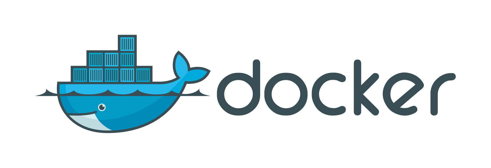

  

## İçindekiler

- [Docker Nedir](#docker-nedir)
- [Docker Mimarisi](#docker-mimarisi)
- [Docker Network](#docker-network)
- [Log Yönetimi](#log-yönetimi)
- [Sistem Kaynakları Yönetimi](#sistem-kaynakları-yönetimi)
- [Environment Variables](#environment-variables)
- [Dockerfile Kullanımı](#dockerfile-kullanımı)
- [Image Yönetimi](#image-yönetimi)
- [Port Yayını](#port-yayını)
- [Dosya Kopyalama](#dosya-kopyalama)
- [Konteynerden Image Oluşturma](#konteynerden-image-oluşturma)
- [Image Yedekleme ve Geri Yükleme](#image-yedekleme-ve-geri-yükleme)
- [Docker Registry](#docker-registry)
- [Temizlik Komutları](#temizlik-komutları)

# Docker Nedir?

Docker, konteynerleştirme teknolojisini kullanarak uygulamaların ve onların bağımlılıklarının taşınabilir, izole edilmiş ortamlar içinde çalıştırılmasını sağlar. Geliştiricilerin uygulamalarını bir "konteyner" içinde paketlemelerine ve bu konteynerleri herhangi bir ortamda çalıştırmalarına olanak tanır. Bu sayede, "çalışıyor ama benim bilgisayarımda" sorunu ortadan kalkar.

# Docker Mimarisi

Docker mimarisi, konteyner tabanlı uygulamaları verimli ve taşınabilir bir şekilde çalıştırmayı sağlayan bileşenlerden oluşur. Temel olarak, Docker mimarisi Docker Daemon, Docker CLI, Docker Image, Docker Container, Docker Registry gibi bileşenleri içerir.

- **Docker Daemon**: Docker motoru olarak da bilinir. Docker konteynerlerini çalıştıran ve yöneten ana bileşendir.
- **Docker CLI**: Komut satırından Docker ile etkileşim sağlayan araçtır. Kullanıcılar burada komutlar girerek Docker'ı kontrol eder.
- **Docker Image**: Uygulamanın çalıştırılabilir halini içeren, üzerinde işletim sistemi ve bağımlılıkların bulunduğu yapı taşlarıdır.
- **Docker Container**: Docker Image’larından türetilen, izole bir ortamda çalışan uygulamalardır.
- **Docker Registry**: Docker imajlarının depolandığı ve paylaşıldığı bir platformdur. Docker Hub en yaygın kullanılan registry’dir.

# Docker Network

Docker Network, konteynerlerin birbiriyle iletişim kurabilmesi için gerekli altyapıyı sağlar. Bu sayede konteynerler, aynı ağ üzerinde birbirleriyle iletişim kurabilir.

# Log Yönetimi

Docker konteynerlerinin loglarını yönetmek, konteynerlerdeki uygulama ve sistem hatalarını izlemek için kritik öneme sahiptir. Docker, konteyner loglarını kolayca izleyebilmeniz için `docker logs` komutunu sunar.

# Sistem Kaynakları Yönetimi

Docker konteynerlerinin kaynak tüketimini kontrol etmek için `docker stats` komutu kullanılır. Bu komut, konteynerlerin CPU, bellek ve disk kullanımını gösterir.

# Environment Variables

Docker konteynerlerinde çevresel değişkenler kullanarak yapılandırma ayarlarını dışarıdan kontrol edebilirsiniz. Bu, uygulamanın çalıştığı ortamı kolayca değiştirebilmenizi sağlar.

# Dockerfile Kullanımı

Dockerfile, Docker imajlarını oluşturmak için kullanılan bir betik dosyasıdır. Bu dosya içerisinde imajın nasıl oluşturulacağına dair talimatlar bulunur.

# Image Yönetimi

Docker imajları, konteynerlerin çalıştırılması için gereken tüm dosya ve bağımlılıkları içerir. Docker imajlarını yönetmek için `docker images` ve `docker rmi` komutları kullanılır.

# Port Yayını

Docker konteynerleri genellikle yerel ağda çalışır. Ancak dış dünyaya erişebilmesi için, konteynerin belirli portlarını yaymanız gerekir. Bu, `docker run -p` komutuyla yapılabilir.

# Dosya Kopyalama

Docker konteynerlerine dosya kopyalamak için `docker cp` komutu kullanılır. Bu komut, konteynerin içinde veya dışındaki dosyaları kopyalamanıza olanak tanır.

# Konteynerden Image Oluşturma

Bir Docker konteynerinden imaj oluşturmak için `docker commit` komutu kullanılır. Bu komut, çalışan bir konteynerin mevcut durumundan bir imaj oluşturmanıza olanak tanır.

# Image Yedekleme ve Geri Yükleme

Docker imajlarını yedeklemek ve geri yüklemek için `docker save` ve `docker load` komutları kullanılır. Bu komutlar, Docker imajlarını bir dosyaya kaydedip, başka bir sistemde tekrar yüklemenize olanak tanır.

# Docker Registry

Docker Registry, Docker imajlarının saklandığı ve paylaşıldığı bir platformdur. Docker Hub, en yaygın kullanılan Docker Registry hizmetidir.

# Temizlik Komutları

Docker ortamını temizlemek için çeşitli komutlar bulunmaktadır. `docker system prune`, `docker container prune`, ve `docker volume prune` gibi komutlar, gereksiz dosya ve konteynerleri temizlemek için kullanılır.

<a href="#top" class="top">Back to Top</a>

