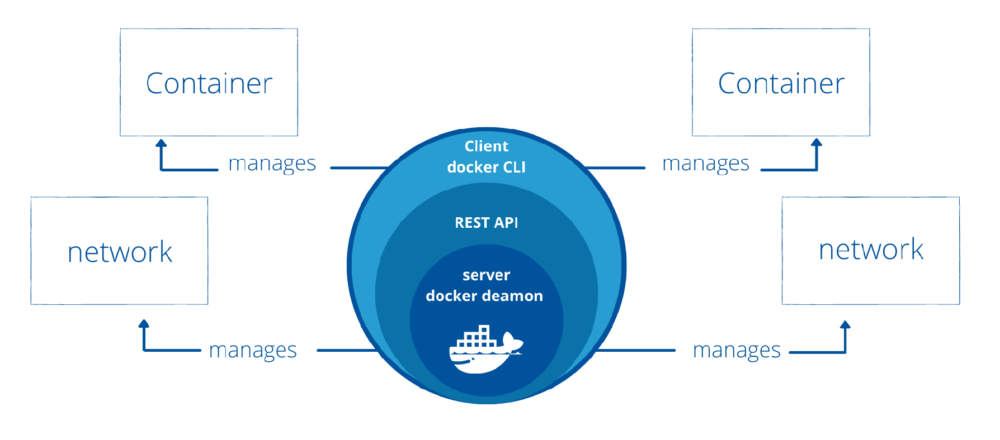

<p align="center">
  
</p>


## İçindekiler

- [Docker Nedir](#docker-nedir)
- [Docker Mimarisi](#docker-mimarisi)
  *  [Docker Daemon(dockerd)](#docker-daemon)
  *  [Docker CLI](#docker-cli)
  *  [Docker Engine REST API](#docker-engine-rest-api)
- [Docker Network](#docker-network)
- [Log Yönetimi](#log-yönetimi)
- [Sistem Kaynakları Yönetimi](#sistem-kaynakları-yönetimi)
- [Environment Variables](#environment-variables)
- [Dockerfile Kullanımı](#dockerfile-kullanımı)
- [Image Yönetimi](#image-yönetimi)
- [Port Yayını](#port-yayını)
- [Dosya Kopyalama](#dosya-kopyalama)
- [Konteynerden Image Oluşturma](#konteynerden-image-oluşturma)
- [Image Yedekleme ve Geri Yükleme](#image-yedekleme-ve-geri-yükleme)
- [Docker Registry](#docker-registry)
- [Temizlik Komutları](#temizlik-komutları)


# Docker Nedir?

Docker, konteynerleştirme teknolojisini kullanarak uygulamaların ve onların bağımlılıklarının taşınabilir, izole edilmiş ortamlar içinde çalıştırılmasını sağlar. Geliştiricilerin uygulamalarını bir "konteyner" içinde paketlemelerine ve bu konteynerleri herhangi bir ortamda çalıştırmalarına olanak tanır. Bu sayede,  "benim bilgisayarımda çalışıyordu" sorunu ortadan kalkar.

# Neden Docker?
* ıncreased portability  - dont have to wory abaout enviroment
* improve scability - vertical, horizantal
* simple and fast deployment - quickly create new containerized instances or rapidly destroy multiple containers
* enhance productivity - promotes a rapid development environment, simplify the installition process and decrease dependency errors
* improve security - each application's major process apart from one another  in separate containers


# Container Nedir ?

Bir container (konteyner), bir uygulamanın çalışması için gerekli tüm bileşenleri (kod, bağımlılıklar, kütüphaneler ve yapılandırmalar) içinde barındıran izole edilmiş bir çalışma ortamıdır. Konteynerler, sanal makineler gibi tüm işletim sistemini değil, yalnızca uygulamanın çalışması için gerekli bileşenleri içerir. Bu nedenle, kaynak kullanımında oldukça hafif ve hızlıdırlar.

<p align="center">
  
</p>


# Docker Mimarisi

Docker mimarisi, konteyner tabanlı uygulamaları verimli ve taşınabilir bir şekilde çalıştırmayı sağlayan bileşenlerden oluşur. Temel olarak, Docker mimarisi Docker Daemon, Docker CLI, Docker Image, Docker Container, Docker Registry gibi bileşenleri içerir.


#### Docker Daemon
Docker Daemon, Docker’ın arka plan sürecidir ve Docker CLI veya Docker API’den gelen komutları işler. Daemon, Docker’ın imaj ve konteyner yönetiminden, ağ yapılandırmasından ve hacim oluşturulmasından sorumludur. Hypervisor’ün dockerdaki karşılığıdır. Bütün CPU ve RAM vb gibi işletim sistemine ait işlerin yapıldığı bölümdür.

#### Docker CLI 
Kullanıcının Docker Daemon ile konuşmasını sağlayan, docker komutlarının çalıştırıldığı CLI ekranıdır. 

#### Docker Engine REST API:
Docker daemon servisine dışarıdan CLI veya uygulamalar tarafından Rest API aracılığı ile erişerek komutlar verebilmeyi sağlayan bileşendir.


## Docker kurulumu 

```
 curl -s https://raw.githubusercontent.com/bayram-ozkan/d0cker/refs/heads/main/_docker-install.sh | sudo bash

```

<a href="#top" class="top">Back to Top</a>


